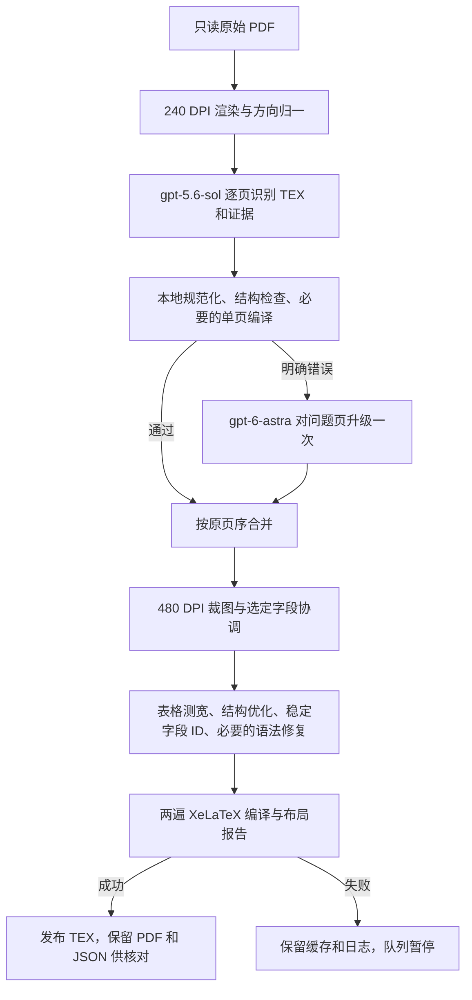

# PDFToTex

将扫描 PDF 转成可编辑 TEX、可预览 PDF 和带稳定字段 ID 的 JSON，保留原始识别结果、模型证据、阶段日志及断点缓存，供人工核对与后续结构化提取。

本文按 2026-09-09 的代码与本机部署整理。当前采用纯视觉识别、按页升级、字段协调和 TEX 优化编译，通过 Docker 容器顺序处理指定批次。宿主机为 macOS / Apple Silicon，容器为 Linux ARM64 CPU 环境，视觉模型通过远程 API 调用。

总项目通过 Git submodule 管理两个独立仓库：`Lexoid` 为识别器，`lexiod-pipeline` 为优化器与流水线。Compose 项目名和镜像名为 `pdftotex`。

## 获取项目

```bash
git clone --recurse-submodules https://github.com/Maxrayyy/PDFToTex.git
cd PDFToTex
```

已克隆总项目但子目录为空时，执行 `git submodule update --init --recursive`。
同步总项目及其记录的子项目版本：

```bash
git pull --ff-only
git submodule update --init --recursive
git submodule status
```

总项目保存 README、Compose、运行脚本、部署文档及两个子仓库的提交引用。修改子项目后，先在子仓库创建开发分支、提交并推送，再在总项目提交更新后的引用。更新前先提交或保存本地改动；不要把 `.env`、模型缓存和转换数据提交到 Git。

## 1. 常用入口

| 需要做什么 | 入口 |
| --- | --- |
| 查看容器状态、PDF 转译列表和阶段进度 | [实时监控 latest.md](../data/monitoring/realtime/latest.md) |
| 按批次年月查看排队和完成情况 | [批次转译进度 batches.md](../data/monitoring/batches.md) |
| 查看每日完成量、页数、token 和估算费用 | [每日统计 daily.md](../data/monitoring/daily/daily.md) |
| 检查正式发布的 TEX | [data/optimized](../data/optimized/) |
| 查编译 PDF、识别证据、日志和缓存 | [data/workers](../data/workers/) |
| 查看批次清单及完成记录 | [data/workers/queues](../data/workers/queues/) |
| 调整 Docker 服务、环境和挂载 | [docker-compose.yml](docker-compose.yml) |
| 查看按页升级细节 | [PAGE_FALLBACK.md](lexiod-pipeline/files/PAGE_FALLBACK.md) |
| 查看字段命名、优化器命令和历史 cron 模式 | [优化器 README](lexiod-pipeline/files/README.md) |

除特别注明外，以下命令都从本目录执行：

```bash
cd /Users/dongdong/code/lexiod/PDFToTex
```

子仓库内还有其他 Compose 文件，分别服务于独立组件或旧流程。当前转换任务使用本目录的 Compose，服务名为 `worker`、`tests`。

## 2. 方案与处理过程



1. **识别**：默认 `RECOGNITION_OCR=none`，主模型为 `gpt-5.6-sol`，使用 `SOL_VISION_REASONING_EFFORT=none`。逐页保存 TEX、字段证据与原始草稿缓存。
2. **按页检查与升级**：先执行确定性的本地 TEX 修正，再检查结构及必要的单页编译。明确结构错误或编译失败触发一次 `gpt-6-astra` 升级，通过后替换该页。普通行数警告、内容不确定或仅 JSON 元数据损坏不会单独触发升级。升级仍失败时保留原结果并记录未解决问题，继续后续阶段。
3. **字段协调**：`gpt-6-astra` 读取 480 DPI 源图裁片，默认只自动复核日期、批号、数量等格式异常。手写/印刷值和勾选不确定等保留首次值与人工核对标记；原始识别 TEX 不被覆盖。
4. **优化**：实际测量弹性列宽，将 `tabularx` 等结构转换成可定位的表格，生成稳定字段 ID，处理分页及 TEX 结构。必要的语法/编译修复使用 `TEXOPT_REPAIR_MODEL=gpt-5.6-sol`。
5. **编译发布**：两遍 XeLaTeX 成功后发布 TEX，工作区保留编译 PDF、字段注册表、布局检查和报告。编译成功不等于内容已人工确认，手写辨识、遗漏和视觉错位仍需核对。
6. **延后语义命名**：默认 `TEXOPT_SEMANTIC_NAMING=deferred`，先交付 TEX/PDF 与基础字段信息，再按需用 `kimi-k3` 补充 JSON 名称。命名不修改字段值或 TEX，也不重新编译。

当前队列同一时刻只处理一份 PDF。主模型与升级模型共享单容器视觉并发额度 2，协调并发为 2；多个容器的额度分别计算。一个 PDF 失败时队列暂停，后续 PDF 保持待处理。

当前识别链路使用视觉模型逐页读取 PDF；Paddle/PaddleX 仅用于页面方向检测。识别结果、问题页升级、字段协调、优化和 XeLaTeX 编译均在同一条 PDF→TeX 流水线中完成。

## 3. 项目结构与数据存储

```text
lexiod/
  Downloads/                         原始 PDF
  PDFToTex/
    README.md                        本文
    docker-compose.yml               当前运行入口
    scripts/
      run-sequential-queue.py         批次队列入口
      resume-none/run.py              旧识别缓存续跑工具
    Lexoid/                          识别器独立仓库
    lexiod-pipeline/                  优化与流水线独立仓库
      Dockerfile.hybrid               运行/测试镜像
      files/                         texopt、流水线、监控脚本
  data/
    optimized/<单位>/<类别>/<批次>/   正式发布 TEX
    workers/<PDF文件名主干>/          每份 PDF 的工作区
    workers/queues/                   队列 JSON、状态、锁
    fix/                              修复、验证及临时产物工作区
    monitoring/realtime/             实时监控
    monitoring/daily/                日报与费用统计
    .cache/semantic-names.sqlite3     共享语义命名缓存
    audits/                          审计记录
```

### 3.1 Docker 挂载

| 宿主机位置（相对本 README） | 容器位置 | 用途 |
| --- | --- | --- |
| `../Downloads` | `/input`，只读 | 原始 PDF |
| `../data` | `/data`，可写 | 结果、工作区、队列、监控、缓存 |
| `./scripts` | `/opt/pdftotex`，只读 | 主仓库管理的队列与续跑脚本 |
| `pdftotex_paddle-cache` 命名卷 | `/root/.paddle` | Paddle 缓存 |
| `pdftotex-paddlex-cache` 外部命名卷 | `/root/.paddlex` | 页面方向检测模型缓存 |

删除容器不删除上述宿主机文件，重建镜像也不清空命名卷。运行脚本随总项目一起克隆，通过只读挂载提供给容器，工作结果写入 `/data`。

`data/fix` 用于修复和验证，容器内路径为 `/data/fix`，不纳入日报扫描。
每次修复使用独立子目录，存放源页截图、修复候选、对比 PDF 和验证日志；正式产物仍发布到 `data/optimized`，生产缓存仍保留在 `data/workers`。

### 3.2 每份 PDF 的产物

以 `Downloads/U1/批次数据/A37Z201202602014/BP-C3152R_20260805_132837.pdf` 为例，正式 TEX 是：

```text
data/optimized/U1/批次数据/A37Z201202602014/BP-C3152R_20260805_132837.tex
```

其工作区为 `data/workers/BP-C3152R_20260805_132837/`。下表的 `<主干>` 指 `BP-C3152R_20260805_132837`：

| 工作区内路径 | 内容 |
| --- | --- |
| `manifest.json` | 最近一轮各阶段状态 |
| `.state/pipeline.sqlite3` | 去重、指纹及阶段完成记录 |
| `.cache/recognition/` | 页级原始识别、规范化、按页升级缓存 |
| `.cache/syntax.json` | 语法修复缓存 |
| `tex/<主干>.tex` | 原始识别 TEX |
| `tex/<主干>.recognition.json` | 识别证据 |
| `tex/<主干>.reconciled.tex` / `<主干>.fields.json` | 协调后的 TEX 与字段记录 |
| `.pipeline/<主干>/*.process.log` | recognize、reconcile、optimise 阶段日志 |
| `.pipeline/<主干>/*.process.calls.jsonl` | 模型调用、usage、重试 |
| `.pipeline/<主干>/<主干>.optimized.tex` | 优化后的工作 TEX |
| `.pipeline/<主干>/<主干>.optimized.layout.pdf` | 编译 PDF，供人工核对 |
| `.pipeline/<主干>/<主干>.optimized.layout.json` | 布局检查 |
| `.pipeline/<主干>/<主干>.optimized.naming.json` | 后续命名计划 |
| `.pipeline/<主干>/<主干>.fields.json` / `<主干>.report.json` | 优化字段注册表与报告 |
| `.pipeline/<主干>/<主干>.compile.log`、`optimise.log`、`probe/` | 编译日志、详细事件与测宽探针 |

尚未执行的阶段没有对应文件。**正式导出目录主要存 TEX，核对用 PDF 在工作区的 `.pipeline/<主干>/` 中**，也可从 `report.json` 的 `layout_check.preview_pdf` 定位。编译临时文件不会全部保留，需要独立 SyncTeX 产物时按优化器文档重新编译验证。

通用目录扫描模式会在工作目录中额外保留源文件相对路径；以上是当前队列的每 PDF 独立工作区。保留 `.state`、`.cache`、manifest 和日志，才能续跑并核查调用费用。

## 4. 环境与配置

需要已启动的 Docker Desktop、Docker Compose v2、可用的模型 API，以及本机 Python 3（监控使用标准库）。当前 Dockerfile 基于本机已有的 `lexiod-texopt:u1` 依赖镜像，其中包含页面方向检测运行时和 XeLaTeX，不能在缺少基础镜像时直接从零构建。

```bash
docker version
docker compose version
docker image inspect lexiod-texopt:u1 --format '{{.Id}}'
docker volume inspect pdftotex-paddlex-cache --format '{{.Name}}'
```

新机器需先导入该依赖镜像，或用 `BASE_RUNTIME_IMAGE` 指定兼容基础镜像。首次部署且确认外部缓存卷不存在时，可执行 `docker volume create pdftotex-paddlex-cache` 创建空卷；它不包含已有权重。

Compose 依次读取 `Lexoid/.env`、`lexiod-pipeline/files/.env`，后者覆盖前者同名项。`lexiod-pipeline/.env` 属于另一个入口，不由当前 Compose 的 `env_file` 自动加载。新部署参考 [files/.env.example](lexiod-pipeline/files/.env.example)，已有配置不要用模板覆盖。

视觉与修复接口使用 `OPENAI_API_KEY`、`OPENAI_BASE_URL`，凭据仅放本地忽略的 `.env`，不写入文档、队列或镜像。当前方案的模型参数为：

```dotenv
LEXOID_MODEL=gpt-5.6-sol
SOL_VISION_REASONING_EFFORT=none
VISION_FALLBACK_MODEL=gpt-6-astra
RECONCILE_MODEL=gpt-6-astra
TEXOPT_REPAIR_MODEL=gpt-5.6-sol
TEXOPT_MODEL=kimi-k3
TEXOPT_SEMANTIC_NAMING=deferred
```

| 参数 | 当前用途与默认行为 |
| --- | --- |
| `RECOGNITION_OCR` | 固定为 `none`；正文识别只使用视觉模型，Paddle 仅负责方向检测 |
| `RENDER_DPI` / `RETRY_DPI` | 默认 `240` / `480` |
| `VISION_CONCURRENCY` | Compose 默认 `4`，当前队列必须显式设置为 `2` |
| `RECONCILE_CONCURRENCY` | 默认 `2` |
| `PIPELINE_STAGE_TIMEOUT_SECONDS` | Compose 默认 `43200` 秒，按阶段计算 |
| `PDF_SOURCE_ROOT` | 通用扫描输入根目录，默认 `/input` |
| `PIPELINE_OUTPUT_ROOT` | 通用扫描工作根目录，默认 `/data` |
| `PIPELINE_PUBLISH_ROOT` | 正式 TEX 根目录，队列模式设置到当前批次 |
| `TEXOPT_NAME_CACHE` | 默认 `/data/.cache/semantic-names.sqlite3` |

优先级为 `docker compose run -e` 高于 Compose `environment`，再高于 `env_file`。例如仅在 `files/.env` 设置视觉并发为 2，不能覆盖 Compose 的默认 4，下面的命令显式使用 `-e`。代码或环境改变后需重建镜像/重建容器，`docker start` 仍使用旧容器配置。修改 Lexoid 依赖后，使用 `./scripts/update-lock.sh` 自动创建或复用 Poetry 环境并重生成锁文件。

## 5. Docker 构建与启动

### 5.1 构建和测试

```bash
docker compose build worker tests
docker compose run --rm --no-deps tests
docker compose run --rm --no-deps worker texopt-pipeline --help
```

镜像为 `pdftotex:local`、`pdftotex-test:local`。构建需要网络下载依赖；测试服务禁用网络，排除已有的两个网络集成测试模块。构建不会更新已经运行的容器。

### 5.2 当前推荐：指定批次队列

入口是主仓库的 [scripts/run-sequential-queue.py](scripts/run-sequential-queue.py)，容器内路径为 `/opt/pdftotex/run-sequential-queue.py`。
当 PDF 工作区存在 `resume-none.json` 时，队列会调用 [scripts/resume-none/run.py](scripts/resume-none/run.py)，校验旧缓存来源并按已记录的设置续跑。
先在 `../data/workers/queues/new-batch.json` 准备新清单，下面的容器名、`NEW_BATCH` 和 PDF 路径均需替换为实际值：

```json
{
  "container": "lexiod-new-batch",
  "monitor_config": "/data/monitoring/realtime/config.json",
  "host_data": "/Users/dongdong/code/lexiod/data",
  "sources": ["/input/U1/批次数据/NEW_BATCH/example.pdf"]
}
```

同一清单按 `sources` 顺序处理。默认使用同一发布目录；跨批次或 U1/U2/U3 时，在 JSON 中设置 `"source_root": "/input"`，并将 `PIPELINE_PUBLISH_ROOT` 设置为 `/data/optimized`，每份结果将保留输入的相对目录。`sources` 和 `monitor_config` 是容器路径，`host_data` 是宿主机路径。监控配置需已存在，初始化见第 7 节。工作区按文件名主干分配，清单中存在同名主干时会拒绝启动，避免工作目录冲突。

先检查清单及页数，不开始转换或调用模型：

```bash
docker compose run --rm --no-deps \
  -e VISION_CONCURRENCY=2 -e RECONCILE_CONCURRENCY=2 -e RENDER_DPI=240 \
  -e PIPELINE_PUBLISH_ROOT=/data/optimized/U1/批次数据/NEW_BATCH \
  worker python /opt/pdftotex/run-sequential-queue.py \
  /data/workers/queues/new-batch.json --prepare-only
```

后台启动，容器名与 JSON 的 `container` 保持一致：

```bash
docker compose run -d --no-deps --name lexiod-new-batch \
  -e VISION_CONCURRENCY=2 -e RECONCILE_CONCURRENCY=2 -e RENDER_DPI=240 \
  -e PIPELINE_PUBLISH_ROOT=/data/optimized/U1/批次数据/NEW_BATCH \
  worker python -u /opt/pdftotex/run-sequential-queue.py \
  /data/workers/queues/new-batch.json
```

这里不使用 `--rm`，以便检查退出码并支持自动重启。队列启动下一份 PDF 时会自动登记实时监控目标。相同清单或相同 PDF 不要在多个容器同时处理，也不要与覆盖相同输入的全目录扫描并行。

脚本校验主/升级模型、240 DPI、并发 2/2 及优化器版本，断言失败通常表示镜像与配置不匹配。重新启动会遍历清单并更新 `.status.json`，是否跳过已完成阶段由各 PDF 的状态库及产物指纹决定，无需手动标记完成。

### 5.3 通用目录扫描

不需要指定清单时，可以扫描一个批次目录。它与队列模式二选一：

```bash
docker compose run -d --no-deps --name lexiod-directory-demo \
  -e PDF_SOURCE_ROOT=/input/U1/批次数据/NEW_BATCH \
  -e PIPELINE_OUTPUT_ROOT=/data/directory-runs/NEW_BATCH \
  -e PIPELINE_PUBLISH_ROOT=/data/optimized/U1/批次数据/NEW_BATCH \
  -e VISION_CONCURRENCY=2 worker
```

默认执行 `texopt-pipeline --once`，扫描一轮后退出，再执行可复用有效阶段。不要省略范围直接启动默认 worker，否则会扫描整个 `/input`。此模式不自动生成 PDF 队列清单或登记监控；需手动登记当前目标，并将新增工作根目录加入日报 `scan_roots`。

## 6. 日常查看、暂停、恢复与清理

```bash
# 查看转换容器
docker ps -a --filter name=lexiod- --format 'table {{.Names}}\t{{.Status}}'

# 跟踪输出，Ctrl-C 只退出日志查看
docker logs --tail 100 -f lexiod-new-batch

# 检查退出码和 OOM
docker inspect --format '{{.State.Status}} exit={{.State.ExitCode}} oom={{.State.OOMKilled}}' lexiod-new-batch

# 停止指定容器
docker stop --time 60 lexiod-new-batch

# 从原队列和缓存恢复，仍使用原代码/配置
docker start lexiod-new-batch
```

强制中断不保证最后一个请求已落盘，已经持久化的有效页和阶段可复用。计划维护前关闭 `auto_restart.enabled` 或停止实时监控调度，避免符合网络暂停条件的容器被自动恢复。

容器已删除时按原名称、队列、挂载和发布路径重新创建。更新代码或 `.env` 时也需重建容器，镜像更新后单纯 `docker start` 不会生效。正常完成并检查结果后，可以删除已退出的指定容器：

```bash
docker rm lexiod-new-batch
```

保留 `*.status.json` 供查看 PDF 清单，保留工作区的 manifest、`.state`、`.cache` 和日志供续跑、审计与费用统计。删除容器不需要删除这些文件，也不需要清空 Docker 模型卷。

## 7. 实时容器与 PDF 监控

### 7.1 入口与展示规则

宿主机运行 [worker_watch.py](lexiod-pipeline/files/worker_watch.py)，使用 [realtime/config.json](../data/monitoring/realtime/config.json)。当前通过 macOS `launchd` 每 **360 秒（6 分钟）**检查一次；脚本默认值为 600 秒，实际以配置及加载任务为准。

| `data/monitoring/realtime/` 中的文件 | 内容 |
| --- | --- |
| `latest.md` | 检测表格、PDF 清单、阶段进度、异常提示 |
| `latest.json` | 完整结构化快照，包括表格中已隐藏的完成容器 |
| `history.jsonl` | 历次快照 |
| `state.json` | 增量日志位置、累计计数和自动重启记录 |
| `runner.log` / `runner.error.log` | 调度输出与监控自身错误 |
| `com.lexiod.worker-watch.realtime.plist` | 实时监控的 launchd 配置 |

检测表格显示当前 PDF 文件名末四位、状态、阶段、缓存页数、新增请求错误/重试/流程错误及 TEX 是否发布。后续进度显示已检查页数、GPT-6 替换页、字段协调统计、优化子步骤、耗时和日志链接。

PDF 清单来自 `data/workers/queues/*.status.json`，只有 `status=done` 且 `exit_code=0` 才计完成。**整批完成并正常退出，或完成后手动删除的容器，只保留 PDF 清单，不再显示检测行及后续进度**。异常退出、未完成队列、发布校验异常和真正的 Docker 连接失败仍提示；容器删除不会再误报为无法连接 Docker。

### 7.2 刷新、安装与停止

```bash
python3 lexiod-pipeline/files/worker_watch.py once \
  --config ../data/monitoring/realtime/config.json

# 任务未加载时安装；安装后立即检查一次
python3 lexiod-pipeline/files/worker_watch.py install \
  --config ../data/monitoring/realtime/config.json

launchctl print "gui/$(id -u)/com.lexiod.worker-watch.realtime"

# 只停止监控调度，不停止转换容器
python3 lexiod-pipeline/files/worker_watch.py stop \
  --config ../data/monitoring/realtime/config.json

tail -n 80 ../data/monitoring/realtime/runner.error.log
```

所有目标均终止且无待执行自动重启时，定时监控自动卸载；以后启动新批次需再次安装。实时 plist 位于数据目录，不会像 `~/Library/LaunchAgents/` 内的文件那样在登录时自动加载。修改间隔需停止再安装，使 launchd 间隔一起更新。休眠或 Docker 暂停会推迟检查。

### 7.3 配置与自动恢复

新环境按以下结构准备配置，先创建 `data/monitoring/realtime` 目录；替换机器路径、PDF 主干和实际页数。直接调用监控脚本要求目标数组非空；队列启动后会自动登记和切换当前 PDF。

```json
{
  "launchd_label": "com.lexiod.worker-watch.realtime",
  "interval_seconds": 360,
  "docker": "/Users/dongdong/.docker/bin/docker",
  "output_dir": "/Users/dongdong/code/lexiod/data/monitoring/realtime",
  "queue_dir": "/Users/dongdong/code/lexiod/data/workers/queues",
  "auto_restart": {"enabled": true, "cooldown_seconds": 360, "max_attempts": 3},
  "containers": [{
    "name": "lexiod-new-batch", "stem": "example", "pages": 10,
    "work_root": "/Users/dongdong/code/lexiod/data/workers/example",
    "output_tex": "/Users/dongdong/code/lexiod/data/optimized/U1/批次数据/NEW_BATCH/example.tex"
  }]
}
```

读取日志本身不调用模型，但启用自动重启后恢复转换会继续调用模型。当前策略每份 PDF 最多自动重启 3 次，冷却至少 360 秒，实际尝试还要等待下一次轮询。

自动重启只针对退出码 1、当前任务因临时模型服务故障明确暂停、且日志与本次运行时间匹配的容器。认证/权限错误、OOM、普通编译失败或已删除容器不会自动重启。维护时可设置 `auto_restart.enabled=false`。

可选 `recover_publish_from` 用于已知发布路径错误：仅在正常退出、manifest 完成、原文件/工作文件/记录的 SHA-256 一致时归位文件，不覆盖已存在的目标。

### 批次进度清单

[批次转译进度](../data/monitoring/batches.md) 由实时监控每 360 秒刷新，按批次编号中的年月倒序排列，同月按末尾流水号倒序。`A39Z201202605032` 拆分为 `A39`（批次）、`Z2`（工艺）、`01`（线）、`202605`（年月）、`032`（流水号）；部分旧编号没有线编码。

同批次在不同 U 目录下的 PDF 合并统计。只有所有 PDF 均有成功完成记录且正式 TEX 有效，批次才标记为已完成；仅存在旧 TEX 会标记待核验。未来年月、无法解析的编号和 `_skip` 目录会单独备注。实时配置的 `batch_status` 指定 `source_root`、`publish_root`、`work_root`、`output_file`，输入和结果仍存放在主仓库外。

## 8. 每日转换与费用监控

宿主机运行 [daily_stats.py](lexiod-pipeline/files/daily_stats.py)，配置为 [daily/config.json](../data/monitoring/daily/config.json)，当前每 **600 秒（10 分钟）**刷新。它只读扫描本地状态、产物和调用日志，不依赖容器仍然存在，也不随转换容器退出而停止。

```bash
python3 lexiod-pipeline/files/daily_stats.py once \
  --config ../data/monitoring/daily/config.json

# 首次安装，同名 LaunchAgent 已存在时不要重复安装
python3 lexiod-pipeline/files/daily_stats.py install \
  --config ../data/monitoring/daily/config.json

launchctl print "gui/$(id -u)/com.lexiod.daily-stats"

python3 lexiod-pipeline/files/daily_stats.py stop \
  --config ../data/monitoring/daily/config.json
```

日报位于 `data/monitoring/daily/daily.md`，结构化输出为 `daily.json`、`daily.jsonl`，同目录保留统计状态与 `runner.log`、`runner.error.log`。任务安装在 `~/Library/LaunchAgents/com.lexiod.daily-stats.plist`，登录后可自动加载；`stop` 仅卸载当前会话，永久停用或重装前还需处理该 plist。

配置的 `scan_roots` 当前只扫描 `data/workers`，`source_root` / `publish_root` 指定输入/正式结果，`path_map` 将 `/input`、`/data` 转换为本机路径。新增工作根目录或迁移机器时同步更新；当前统计开始日为 `2026-09-07`，已记账的历史统计保留。

- 完成条件：优化阶段完成、编译成功、生成 PDF 存在，且正式 TEX 与任务产物哈希一致。仅有 TEX 文件不足以计入完成。
- 按北京时间任务完成日归档，源页数和生成页数分别统计。跨天任务的已记录 token 归到完成日，不等同于接口调用日账单。
- 调用按 `call_id` 去重，包括识别、升级、协调、优化和重试。并行请求累计耗时不能当作墙钟耗时。
- 费用由 [model_prices.json](lexiod-pipeline/files/model_prices.json) 估算；缺失 usage、未知价格和未计价模型明确标记，不能把未知费用当作零或按 GPT 价格估算 Kimi。
- JSON 校验及溢出页数不阻断完成计数，因此日报的“完成”仍需结合 PDF 人工核对。

## 9. 后续命名与可选模型预热

补充命名前配置独立的 `TEXOPT_NAMING_PROVIDER`、`TEXOPT_NAMING_BASE_URL`、`TEXOPT_NAMING_API_KEY`，保留视觉接口的 `OPENAI_*` 设置。替换下例的 `example` 为真实 PDF 主干：

```bash
docker compose run --rm --no-deps worker texopt name-fields \
  /data/workers/example/.pipeline/example/example.optimized.tex \
  --registry /data/workers/example/.pipeline/example/example.fields.json \
  --output /data/workers/example/.pipeline/example/example.enriched.json \
  --model kimi-k3 --name-cache /data/.cache/semantic-names.sqlite3
```

命名验证 TEX、计划与 JSON 哈希，按稳定 ID 补充名称。缓存使用本地 SQLite，不放到不支持 SQLite 锁的网络共享目录。`name_status=complete` 只表示名称已生成，不表示业务数据已经核验。

方向检测模型缓存由容器启动时按现有缓存加载；首次运行需要网络访问以完成模型准备。当前未设置单容器内存上限，仍受 Docker Desktop 全局内存和 swap 限制。

## 10. 常见问题与备份

| 现象 | 排查与处理 |
| --- | --- |
| Docker 无法连接 | 确认 Docker Desktop 运行、socket 可访问、监控中的 Docker 绝对路径正确 |
| 缺少基础镜像/外部模型卷 | 按第 4 节准备，不依赖旧的运行中容器 |
| 队列断言失败 | 核对模型、DPI、并发 2/2 和镜像中的优化器版本 |
| 改 `.env` 后未生效 | 核对当前入口与配置优先级，再重新创建容器 |
| 容器退出码 1 | 查看队列状态和当前阶段日志，区分网络暂停、凭据故障和编译失败 |
| 正式目录没有 PDF | 查看 worker 的 `.pipeline/<主干>/*.optimized.layout.pdf` |
| 删除容器后仍有 PDF 清单 | 正常保留完成记录供核对，检测表格中已隐藏 |
| 实时监控不再刷新 | 检查全部完成后的自动卸载、休眠和 `runner.error.log` |
| 报告有 JSON/版式警告但显示完成 | 编译成功与内容核验不同，应对照源 PDF 检查字段和布局 |

备份至少包含原始 PDF、`data/optimized`、`data/workers`（含隐藏目录）、`data/.cache`、监控配置和统计状态、总项目及两个子仓库、本地环境配置。迁移后更新宿主机绝对路径、日报价格文件路径、工作区文件与两个监控 plist，并重新加载定时任务。
