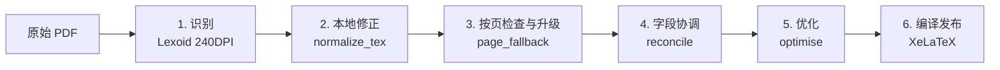

# PDFToTex 完整流水线设计

本文档描述 PDFToTex 的完整识别、转换、优化、编译流水线设计，包括每个阶段的流程、核心算法、小设计和小规则。

---

## 总览

**目标**：将扫描 PDF 通过"视觉识别 → 本地修正 → 检错升级 → 字段协调 → 表格转换 → 语义命名 → 编译发布"七阶段，转为带可编辑字段注释、支持 SyncTeX 逐格定位的 TeX 源码和 PDF。



**整体架构**：

- **双仓库**：`Lexoid/`（独立 Git 子模块，视觉识别核心），`pipeline/`（纳入总仓库，流水线与优化器）
- **Docker 部署**：`docker-compose.yml` 生产入口，容器名为 `pdftotex`
- **宿主机目录**：`Downloads/`（原始 PDF）、`data/`（工作区/产物/监控/缓存），与 `PDFToTex/` 平级

---

## 阶段零：入口与队列

**源码**：`scripts/run-sequential-queue.py`

### 流程

1. 读取 JSON 清单（`new-batch.json`），包含 `source` PDF 列表、发布目录
2. 校验主/升级模型、DPI、并发数、优化器版本
3. 逐份顺序处理，使用 `PipelineState`（SQLite）记录阶段完成状态和产物指纹
4. 清单存在同名主干时拒绝启动，避免工作目录冲突

### 小设计

- **阶段指纹**：`sha256(version + argv + inputs_sha256)`。代码升级或输入变化自动重新执行，否则复用缓存。
- **`batch.lock`**：文件锁（`fcntl.flock(LOCK_EX | LOCK_NB)`）防止同批次被多个容器同时跑。
- **原子写入**：所有产出通过 `write_utf8_atomic`（`.tmp` 临时文件 + `os.replace`）写入，避免中断半成品。
- **断点续跑**：中断恢复时通过 `state.recover_interrupted()` 重放未完成阶段；`manifest.json` 记录每份 PDF 各阶段状态、耗时、模型调用次数。
- **模型服务暂停**：`ModelServicePaused` 异常 → 队列暂停当前及其后 PDF，不丢失已完成阶段。
- **`model_service_unavailable` 检测**：扫描 `.calls.jsonl` 中 `offset` 之后是否出现过该事件，仅响应当前运行期的故障（不误读历史日志）。
- **自动重启**：实时监控可配置 3 次自动重启，仅针对退出码 1 + 模型服务故障的容器。

### 产物

```
manifest.json          ← 最近一轮各阶段状态
.state/pipeline.sqlite3 ← 去重、指纹及阶段完成记录
```

---

## 阶段一：视觉识别

**源码**：`pipeline/texopt/runtime/stages.py`（编排），`Lexoid/`（识别核心，通过 CLI `lexoid latex` 调用）

### 流程

1. **240 DPI 渲染** → 渲染 PDF 页面为 PNG
2. **Paddle 方向检测** → 自动旋转归一（`--auto-orient`）
3. **`gpt-5.6-sol`** 逐页识别，输出 TeX + 识别证据 JSON
4. `RECOGNITION_OCR=none`：Paddle/PaddleX **仅用于页面方向检测**，正文纯视觉模型

### 小设计

- **渲染缓存**：第 1 页的渲染结果供后续升级复用，不重复渲染。
- **跨页并发**：`VISION_CONCURRENCY=2`，同一容器同时最多 2 个视觉请求。
- **证据 JSON**（`recognition/v1` schema）：
  ```json
  {
    "schema": "recognition/v1",
    "document_sha256": "...",
    "pages": [{
      "page": 1, "render": {"dpi": 240, "width": 2000, "height": 2800, "rotation": 0},
      "fields": [{"field_id": "LEX-P0001-V0001", "bbox": [120, 300, 200, 320], "value": "42", "label": "数量"}],
      "ocr_blocks": []
    }]
  }
  ```
- **字段 ID 约定**：`LEX-P{page:04d}-V{seq:04d}`（视觉字段）或 `-C{seq:04d}`（印刷字段），页码在 ID 中硬编码，用于交叉校验。
- **页完成标记**：每页末尾写入 `% LEXOID_PAGE_COMPLETED: {page}/{total}`，用于页码完整性校验和断点定位。
- **`#FIELD_VALUE:` 注释**：字段上方包含 `#VALUE_ID:` 和 `#FIELD_VALUE:` 注释，供后续阶段定位字段。
- **并发安全**：多页识别结果的合并操作受互斥锁保护。

---

## 阶段二：本地确定性修正（`normalize_tex`）

**源码**：`pipeline/texopt/optimization/local_tex.py`

这一阶段**不调模型**，纯正则 + AST 分析。是流水线最大的优化之一：一次性消除视觉模型 90% 以上可预测的格式缺陷，避免后续阶段无谓调用昂贵的 LLM。

按顺序执行 25+ 条规则，每条返回 `(text, changed_count)`：

| 规则 | 文件/函数 | 解决的问题 |
|------|----------|-----------|
| `literal_model_newlines` | `normalize_literal_model_newlines` | 模型输出的字面 `\n` 变成真正换行 |
| `numeric_text_backslashes` | `normalize_numeric_text_backslashes` | `A37Z...\\2605031` 变成 `\textbackslash{}2605031` |
| `text_hashes` | `normalize_text_hashes` | 文档正文的 `#` 转义为 `\#`，但保留宏定义中的参数 `#1` |
| `handwritten_text_backslashes` | `normalize_handwritten_text_backslashes` | `\handwritten{3\\#A}` 中的 `\\` 安全转为文本反斜杠 |
| `unclosed_makebox_rows` | `normalize_unclosed_makebox_rows` | 关闭同行未闭合的 `\underline{\makebox{...}` |
| `unclosed_field_rows` | `normalize_unclosed_field_rows` | 关闭同行未闭合的 `\fieldvalue{...` |
| `unclosed_tabular_specs` | `normalize_unclosed_tabular_specs` | 关闭 `\begin{tabular}{*{3` |
| `control_word_boundaries` | `normalize_control_word_boundaries` | CJK 前的控制词加空格以免吃掉中文字符 |
| `text_math_symbols` | `normalize_text_mode_math_symbols` | 文本模式中的 `\times`、`\div`、`\pm` 套上 `\ensuremath{}` |
| `text_mode_carets` | `normalize_text_mode_carets` | 将 `\textasciicircum{}` 转正则 `\^{}` |
| `handwritten_raw_superscripts` | `normalize_handwritten_raw_superscripts` | `\handwritten{abc^123}` → `\textsuperscript{123}` |
| `field_metadata_comments` | `normalize_field_metadata_comments` | 恢复表格中逃逸的 `\% #VALUE_ID:` 为 `% #VALUE_ID:` |
| `inline_field_metadata_comments` | `normalize_inline_field_metadata_comments` | 将行内 `#VALUE_ID` 注释提到独立行 |
| `stray_cjk_backslashes` | `normalize_stray_cjk_backslashes` | 修复视觉模型中 CJK 字符前的多余反斜杠 |
| `unmatched_closing_braces` | `normalize_unmatched_closing_braces` | 去掉多余右大括号 |
| `hline_row_boundaries` | `normalize_hline_row_boundaries` | 修复 `\hline` 上游走的行边界 |
| `standalone_newlines` | `normalize_standalone_newlines` | 独立换行清理 |
| `multicolumn_linebreaks` | `normalize_multicolumn_linebreaks` | 保持多栏单元格内视觉换行 |
| `math_blank_lines` | `normalize_math_blank_lines` | 数学环境中的空行替换为注释行 |
| `ulem_text_scripts` | `normalize_ulem_text_scripts` | ulem 下划线中的 `\textsuperscript` 包裹 `\mbox{}` 防止断词 |
| `experimental_figure_frames` | `normalize_experimental_figure_frames` | 缺失的实验性图片用占位框显示 |
| `missing_graphics` | `normalize_missing_graphics` | `\includegraphics{missing}` → `\IfFileExists{}{}{}` |
| `panel_rules` | `normalize_panel_rules` | minipage 中的 `\hline` 替换为 `\rule{\linewidth}{0.4pt}` |
| `split_paragraph_rows` | `normalize_split_paragraph_rows` | 跨行拆分但属于同一行的字段合并 |
| `table_row_endings` | `normalize_table_row_endings` | 对齐命令覆盖的行结尾恢复为 `\tabularnewline` |
| `table_heading_breaks` | `normalize_table_heading_breaks` | 冒号结尾的标题后插入 `\par` |
| `uniform_table_overflow` | `normalize_uniform_table_overflow` | 所有行多一列时自动补一列活宽 `l` |
| **`inject_support`** | `inject_support` | 自动检测缺失包并注入 `\RequirePackage` |

### inject_support 的包检测逻辑

自动检测文档中使用但未声明的包，通过正则匹配 TeX 命令：

| 包 | 检测模式 | 说明 |
|----|---------|------|
| `array` | `\arraybackslash` / `\newcolumntype` / `\begin{array}` | |
| `amsmath` | `\text` / `\dfrac` / `\begin{align}` | |
| `amssymb` | `\diagup` / `\checkmark` / `\square` | |
| `upgreek` | `\upalpha` 等 | 希腊字母 |
| `graphicx` | `\includegraphics` / `\resizebox` | |
| `pict2e` | `\begin{picture}` | |
| `multirow` | `\multirow` | |
| `booktabs` | `\toprule` / `\midrule` / `\bottomrule` | |
| `makecell` | `\makecell` / `\thead` | |
| `tabularx` | `\begin{tabularx}` | |
| `longtable` | `\begin{longtable}` | |
| `tikz` | `\begin{tikzpicture}` / `\tikz` | |
| `ragged2e` | `\RaggedRight` 等 | |
| `enumitem` | `\setlist` | |
| `xcolor` | `\textcolor` / `\color` / `\definecolor` | |
| `ulem` | `\sout` / `\uline` 等 | 带 `[normalem]` 选项 |

此外还注入 `\fieldvalue`、`\handwritten`、`\LexoidExperimentalFigure` 的 `\providecommand` 定义，保证这些宏在任何文档类下都可编译。

### 设计原则

- **确定性** → 纯字符串/正则操作，零模型调用
- **无副作用** → `(source, count)` 纯函数
- **顺序依赖** → `normalize_tex()` 按固定顺序依次应用，后一步可能修复前一步的剩余问题
- **两次归一化** → 识别完成后一次 + 优化完成前一次，确保 TeX 在所有阶段之间都是规范形式

---

## 阶段三：按页检查与升级（`page_fallback`）

**源码**：`pipeline/texopt/recognition/page_fallback.py`

### 流程

```
每页识别结果 →
  1. normalize_tex（本地修正）
  2. 抽取前导码（第 1 页缓存）
  3. 成独立文档 → 结构检查（validate_latex） + XeLaTeX 试编译
  4. 有错误？→ gpt-6-astra 升级一次 → 再次结构检查 → 通过则替换
  5. 无错误？→ 保留原始识别
```

### 结构检查（`structural_issues`）

1. `validate_latex`：括号匹配、环境嵌套、表格列数、未闭合数学模式、控制字符
2. 检测**连续短行拆分的字段行**（SPLIT_FIELD_ROW）：当预期列数 ≥ 3 且某行实际列少于预期时，记录为"短行"；连续 2+ 行短行、期中某行含 `\fieldvalue`、且这些行无 `\multirow`/`\multicolumn` 时标记错误。这捕获视觉模型将一个字段值跨行拆散的场景。
3. `% LEXOID_RECOGNITION_FALLBACK` 标记视为空识别（错误）

### XeLaTeX 试编译

```python
subprocess.run(["xelatex", "-no-shell-escape", "-interaction=nonstopmode",
    "-halt-on-error", "-file-line-error", "page.tex"], timeout=30)
```

- 30 秒超时 → 超时后以 warning 标记 `COMPILE_CHECK_UNAVAILABLE`
- 返回码非零 → `COMPILE_ERROR`

### 升级决策

```
结构检查 + 编译通过      → 保留原始识别
有错误且升级模型 ≠ 主模型 → 触发一次 gpt-6-astra 升级
升级后仍失败             → 保留原始识别，记录未解决
模型服务不可用            → ModelUnavailableError → 队列暂停
```

### 小设计

- **SHA-256 缓存**：`check.json` 以 `{version + tex}` 为 key，避免重复编译和重复检查。
- **升级原子性**：`attempt.json` 文件持久化升级状态。中断恢复读到 `status: started` 或 `status: failed`（可重试服务错误）会重新执行；读到 `status: returned` 直接复用。
- **仅一次升级**：`max_page_attempts=1`，失败不循环，避免无限成本。
- **升级失败不改写原文**：失败的 `VisionPageResult` 以原文替换，不污染 TeX。
- **第一页的特殊处理**：第 1 页的 preamble 被缓存并用于后续所有页的独立编译，保证跨页有相同前导码。
- **`page_models` 记录**：`report["page_models"]` 记录每页实际使用的模型（`gpt-5.6-sol` 或 `gpt-6-astra`），写入证据 JSON。
- **`page_fallback` 开关**：当 `fallback_model == vision_model` 时跳过升级（直接返回原文），用于测试或禁用升级的场景。

---

## 阶段四：字段协调（`reconcile`）

**源码**：`pipeline/texopt/optimization/reconcile.py` + `reconcile_budget.py`

### 背景问题

纯 TeX 识别路径生成的字段坐标是整页占位（`bbox = [0, 0, page_width, page_height]`）。旧版逐字段以 480 DPI 裁图，导致同一页 N 个异常字段重复发送 N 次整页图片。

### 流程

```
reconcile_document:
  1. select_exceptional_fields       ← 对比 TeX 值和识别证据，标记异常字段
  2. has_local_coordinates?           ← 判断坐标是否有效/局部
     ├─ 是 → crop 模式（逐字段局部裁图）
     └─ 否 → page 模式（按页合并，单请求复核全部字段）
  3. resolve_group:
     ├─ crop → adapter.reconcile()   ← 480 DPI 局部裁图 + 单字段请求
     └─ page → reserve_page_request() + adapter.reconcile_page() ← 整页图 + 多字段请求
  4. 写缓存 *.reconcile-cache.json    ← 指纹包含 source+field+render+dpi+mode+context+model+version
  5. 写 TeX（替换通过/保留标记）
```

### 字段筛选（`select_exceptional_fields`）

对比 TeX 和识别证据，标记需要复核的字段及其原因：

| 原因 | 触发条件 |
|------|---------|
| `tex_evidence_value_mismatch` | TeX 值与识别值不一致 |
| `paddle_model_conflict` | Paddle 与模型识别值冲突 |
| `handwritten_review_marker` | TeX 中有 `#TODO #HANDWRITTEN` 标记 |
| `low_paddle_score` | 附近 OCR block 置信度 < 0.70 |
| `critical_format_invalid` | 日期/批号/数量格式异常 |
| `unclear_checkbox` | 复选框状态为 `unclear` |
| `unmatched_ocr_value` | OCR 识别值未匹配到字段 |
| `model_uncertainty` | 识别模型标记 `needs_review` |

### 坐标有效性判断（`has_local_coordinates`）

```python
def has_local_coordinates(candidate):
    box = candidate.field.get('bbox')
    width, height = candidate.render['width'], candidate.render['height']
    # 必须是 4 元素浮点/整数列表
    # 必须在页面范围内
    # 加入 40px 裁图边距后面积 < 页面面积的 90%
    area = (min(width, x1 + 40) - max(0, x0 - 40)) * \
           (min(height, y1 + 40) - max(0, y0 - 40))
    return area < width * height * 0.90
```

### 整页请求预算（`reconcile_budget`）

```python
reserve_page_request(budget_path, source_hash, page, max_page_requests)
```

- 通过 `fcntl.flock` 文件锁保证并发安全
- 以 `{source_hash}:{page}` 为 key 计数
- CLI 参数 `--max-page-requests`：默认 2，可选 1~3
- 失败和中断也占次数；重启、字段变化、模型变化、DPI 变化不重置上限
- 账本损坏时禁止新增整页调用，不能通过自动清空账本继续花费

### 小设计

- **`RECONCILE_VERSION = "reconcile-v3-page-groups"`**：版本标记；缓存指纹包含此版本号。
- **`_validate_reply`**：独立校验模型返回的 JSON—必有 `value`（str）、`confidence`（[0,1]）、`needs_review`（bool）、`reason`（str）。
- **裁剪边距**：`padding = 40 * (retry_dpi / render_dpi)`，按 DPI 比例缩放，保证不同分辨率下边距一致。
- **页面上下文**：page mode 请求附带 `page_context`（该页所有字段的 ID + label + value + TeX 上下文），帮助模型定位字段。
- **线程安全**：`_PDF_LOCK` 锁保护 pypdfium2 的 PDF 读取，`cache_lock` 保护缓存写入。
- **服务不可用标记**（`threading.Event`）：一旦检测到模型服务不可用，所有剩余待处理字段直接标 deferred，不空轮询。
- **并发协调**：`ThreadPoolExecutor(max_workers=concurrency)`，但 page mode 请求独立执行不并行（受 budget 限制）。
- **价格测算**：读取 `model_prices.json`，支持环境变量 `RECONCILE_PRICING_FILE` 覆盖。缺失用量或价格时记 `unknown`，不冒充零费用。
- **调用日志**：写入 `calls.jsonl`，包含页码、字段信息、图片尺寸、DPI、Token 用量、估算费用。不记录请求密钥或图片 Base64。

### 验收规格

- 默认只自动复核日期、批号、数量等格式异常
- 手写/印刷值不确定 → 保留首次值与人工核对标记
- 原始识别 TeX 不被覆盖
- 返回不确定或服务失败时保留原值 + `#TODO #REVIEW` 标记

---

## 阶段五：语法修复（`syntax_repair`）

**源码**：`pipeline/texopt/optimization/syntax_repair.py`、`syntax_check.py`

此阶段是优化（`cmd_optimise`）的第一步，是**可选**的 LLM 辅助修复。

### 流程

```
validate_latex(src) → 有错误？
  ├─ 否 → 跳过修复
  └─ 是 → LLMSyntaxRepairer.repair_document(src)
            → normalize_tex(修复结果)
            → validate_latex(修复结果)
            → 引入新错误？→ 回退到修复前文本
            → 未改变文本？→ 停止修复循环
```

### 结构校验（`validate_latex`）

| 校验项 | 说明 |
|--------|------|
| 括号平衡 | `{` 和 `}` 全局平衡检查 |
| 环境嵌套 | `\begin`/`\end` 匹配，允许自身嵌套 |
| 表格列数对齐 | 遍历每个表格行，统计 `multicolumn` 跨度，与列规格预期对比 |
| 未闭合数学模式 | `$`/`$$` 跨越段落或页面边界时标记 |
| Tabular 宽度参数 | `\begin{tabular}{...{...` 不允许宽度参数（只有 tabularx 需要） |
| 不透明表格 | 检测无法实现 SyncTeX 逐格定位的环境 |
| 控制字符 | `U+0000`-`U+001F`（除 `\n\r\t`） |

### 批量修复策略

- **按页批量**：将文档按 Lexoid 页标记分割，将错误页及上下文发送给模型统一修复
- **缓存**：SHA-256 指纹缓存在 `syntax.json`，避免重复修复同一页
- **定向重试**：修复后仍存在的错误 → 定位页号 → 仅重试那些页（`target_pages`）+ 诊断提示 → 最多 3 次
- **停滞检测**：两次连续修复后错误签名不变则停止

### 修复不变量

```python
repair_invariant_violations(repair_input, repaired_output):
```

检查模型修复没有破坏：
1. `#VALUE_ID:` 标记的完整性
2. `#FIELD_VALUE:` 注释
3. `#HANDWRITTEN:` 标记
4. 字段值的正确性

违反任一不变量 → 修复被标记为 blocked。

### 小设计

- **退化安全**：`failed` 批次的修复只要当前 source 通过结构 + 不变量校验，仍然可以继续（`SYNTAX_REPAIR_DEGRADED_SAFE`）。
- **硬对齐保护**：原始文档只有 "underfull rows" 警告，但修复引入硬性 "mismatch" 错误 → 回退。因为模型可能会把良性的对齐警告搞成真正的断列错误。
- **语法修复快照**：`--syntax-repair-output` 可选写入 `.tex`，仅调试用，非交付产物。

---

## 阶段六：优化（`optimise`）— 7 个子步骤

**源码**：`pipeline/texopt/optimization/cli.py`（`cmd_optimise`），当前版本 `texopt-layout-v11-outline-field-safe`

这是最复杂的阶段，分为 7 个子步骤：

### [1/7] 读取与规范化

1. `canonicalize_document_terminator`：清理多余/中间态的 `\end{document}`
2. `normalize_tex`：再次应用全部 25+ 条确定性规则（识别后的归一化可能引入了新的小问题）
3. `prepare_layout`：从识别证据中提取每页的底面朝向、纸张尺寸 → 注入 `\LexoidPageStart` / `\LexoidPageEnd` 宏，保持源 PDF 页面边界

#### 页面布局定向（`prepare_layout`）

每个源 PDF 页面在 TeX 中对应一个 `\LexoidPageStart{page}{width}{height}{profile}` ... `\LexoidPageEnd{page}` 块。

- **profile 0**：正常字号 + 标准间距（用于图片/大排版页）
- **profile 1**：10pt 字体 + 紧凑间距（用于数据页默认）
- **profile 2**：9pt 字体（用于溢出压缩）

关键宏：

| 宏 | 功能 |
|----|------|
| `\LexoidPageStart` | `\clearpage` + `\newgeometry{...}` + 设置字号/间距 |
| `\LexoidPageEnd` | `\par` + `\endgroup` |
| `\LexoidPanelBegin`/`\End` | `adjustbox` 包裹可溢出面板，`max totalsize={\linewidth}{\remaining}` |
| `\LexoidPageMark` | 写入 `.lxp` 布局日志，记录每页 start/end 和绝对页码 |

溢出处理：

```latex
\newdimen\LexoidPanelHeight
\newcommand{\LexoidPanelLimit}{%
  \LexoidPanelHeight=\dimexpr\pagegoal-\pagetotal\relax
  \ifdim\LexoidPanelHeight>\textheight \LexoidPanelHeight=\textheight\fi
  \ifdim\LexoidPanelHeight<.5\textheight \LexoidPanelHeight=\textheight\fi
  \advance\LexoidPanelHeight by -3\baselineskip}
```

如果 `\pagegoal - \pagetotal` 不足以容纳面板、但面板又 ≤ `0.5\textheight`，则允许使用 `\textheight` 全高。

### [2/7] 表格审计（`opaque` 检测）

**源码**：`pipeline/texopt/optimization/opaque.py`

扫描全部表格环境，分类：

| 类型 | 环境 | 特征 |
|------|------|------|
| **透明** | `tabular`、`tabular*`、`array`、`longtable`、`supertabular` | body 逐行读取 → SyncTeX 可定位 |
| **不透明** | `tabularx`、`tabulary`、`tabu`、`longtabu`、`xltabular` | body 被吸收进 token list 重排 → SyncTeX 全表定位到同一行 |

为什么 tabularx 不透明？TeX 将 tabularx body 存储到 token 寄存器后多次重排以求解 X 列宽度。重排时 token 已丢失原始文件行号，SyncTeX 无法区分正确定位，也无法在这类环境中使用 `\verb`。

转换映射：

```python
CONVERSION = {
    "tabularx":  (True,  "tabular"),     # (有宽度参数?, 目标环境)
    "tabulary":  (True,  "tabular"),
    "tabu":      (False, "tabular"),
    "longtabu":  (False, "longtable"),
    "xltabular": (True,  "longtable"),
}
```

### [3/7] 探针测宽

```python
widths = {}  # {(table_id, col_index): width}
need_probe = [t for t in tables if static_widths(t) is None]
```

- **静态求解**：`展开 *{n}{...} → ` 所有 X 列均分 `\linewidth - 2\tabcolsep * n` → 不需要编译
- **编译测宽**：注入 `>{\TXPROBE{table_id}{col}}` 到列规格，编译，从日志解析 `TEXOPT-W t{id} c{col} {width}`

探针编译在独立临时目录进行，使用 `TEXINPUTS` 环境变量继承源目录的搜索路径。

### [4/7] 不透明表格转换

```python
src, conv_report = opaque.convert(src, widths, strict=not allow_opaque)
```

转换算法：
1. 找到 `\begin{tabularx}{width}{spec}`
2. 解析列规格（支持 `*{n}` 展开、`>`/`<` 装饰列）
3. 将 X/L/C/R/J 列替换为 `p{<measured_width>}` 或 `p{<default>}`
4. 去掉宽度参数 → `\begin{tabular}{new_spec}`
5. 保留所有 `>{}`/`<{}` 装饰、列分隔符 `|`、`@{}` 等

转换后验证：
- 转换报告记录每个表原始环境、列数、宽度来源
- 保留未转换的不透明表 → 生产中以 WARNING 记录，但允许发布（因规范约定需要更好的 SyncTeX 支持）

#### 探针失败修复循环

```
测宽编译失败 → 定位第一错误页 → LLM 修复 → 重新测宽 → 重新转换 → 循环
```

最多 3 次。每次测宽编译使用不同的 `jobname`（`texopt_probe_retry_N`），防止缓存污染。

停滞检测：两次修复后测宽的列数没有增加 → 停止。

### [5/7] 表格重构与字段标注

这是最复杂的子步骤，分三层：

#### 第一层：`sanitize_handwritten_fields`

将 `\handwritten{...}` 中的 TeX 特殊字符转义。保留内联数学片段 `$...$` 不变，科学计数法 `123^456` 转为 `123\textsuperscript{456}`。

#### 第二层：`transform_tex`（`tex_tables.py`）

**这是流水线的核心技术之一**。它将每个表格的每个单元格放到单独一行，并在开头插入 `\SA{}`（零尺寸 SyncTeX 锚点）：

```latex
% 转换前：
a & b & c \\

% 转换后：
\SA{}a &
\SA{}b &
\SA{}c \\
```

**为什么这样做？**

- TeX 构建 `\halign` 时，SyncTeX 的盒记录只能记录**行号**
- 整行在一个源行 → SyncTeX 能定位到行但**不能定位到列**
- 每单元格独立成行 + `\SA{}` → 每个单元格独立盒记录 → 逐格 SyncTeX 定位

**渲染中性论证**：
- `\SA{}` 是 `\leavevmode\hbox{}` → 零宽零高零深度，无胶水，不改变模式
- `\ignorespaces` 会吃掉新行引入的空格（LaTeX 列模板的标准行为）
- 不向 `\\` 之前引入空格

支持的表格环境：`tabular`、`tabular*`、`tabularx`、`tabulary`、`longtable`、`array`、`matrix`、`align`、`gather` 等。跳过的环境：`verbatim`、`lstlisting`、`minted`、`comment`、`filecontents`。

**`\SA` 宏定义**：

```latex
\providecommand{\SA}{\leavevmode\hbox{}\relax}
```

在 l/c/r 列中已处于 restricted horizontal mode → `\leavevmode` 是 no-op
在 p/m/b 列中 `\leavevmode` 启动段落，`\parindent` 已被 `\@parboxrestore` 设为零

#### 第三层：`annotate_fields`（`fields.py`）

**字段检测**：

解析每个表格块，提取：
- 行头（第一列内容）、列头（表头行）
- `\fieldvalue{...}` 中的值
- `#VALUE_ID:` 和 `#FIELD_VALUE:` 元数据注释（向上搜索最多 32 行）

**页面跟踪**（`PageTracker`）：

从 TeX 中提取页码，支持三种标记：
1. `% --- page 1 ---` / `% p. 1`
2. `% LEXOID_PAGE_COMPLETED: 1/10`
3. `\newpage` / `\clearpage`（无显式标记时的降级策略）

**幂等 ID 生成**（`fingerprint`）：

```python
fingerprint = sha256(page + table + row_header + col_header + raw_value)[:16]
```

- 同一文档的同一格始终产生同一 ID
- 有 `#VALUE_ID:` → 直接复用（权威来源）
- 无 ID → `fingerprint`
- 跳跃非 ASCII 内容 → `r{row:02d}c{col:02d}`（位置名，稳定可搜索）
- 旧式后备：`LEX-P{page:04d}-V{seq:04d}`

**语义命名**：

| 策略 | 说明 | 适用 |
|------|------|------|
| `HeuristicNamer` | 纯本地 slug，ASCII 降级；CJK 退化为位置名 | 默认/离线 |
| `CachedLLMNamer` | 调模型翻译，缓存到 SQLite，互斥锁隔离 | 有 API Key 时 |
| `DeferredBatchNamer` | 仅记录请求，不立即命名 | `TEXOPT_SEMANTIC_NAMING=deferred` |

LLM 命名提示词模板：

```
You are naming a form field extracted from a scanned document.
Table: {table}
Row label: {row}
Column label: {col}
Handwritten value: {val}
Nearby text: {near}

Reply with ONE snake_case English identifier (2-4 words, ASCII, no prefix)
```

**`\hwfield` 包裹**：

```latex
\hwfield{field_id}{value}
```

- 同一物理行上遇到 `\multicolumn` 不会包裹结构命令
- 尾随奇数个反斜杠自动补空格，防止 `\}` 逃逸
- 多行 `\fieldvalue{` 跨行时自动找到平衡括号位置包裹

### [6/7] 写输出

1. 去除显式 SyncTeX 锚点：`\SA{}` → 空格（保留 `\hwfield` 内部的 `\SA`）
2. 页面布局调整（再次注入 `\LexoidPageStart`/`\End`，可能因溢出压缩字号）
3. 最终 `normalize_tex` 归一化
4. 原子写入 `.tex`

### [7/7] 编译校验

- 双遍 XeLaTeX 编译，`-synctex=1` 启用 SyncTeX
- CTEX 文档类时注入 `\PassOptionsToClass{fontset=fandol}` 保证容器内字体兼容
- 布局校验：源页码 → 编译后的页面对应关系（来自 `\LexoidPageMark` 的 `.lxp` 文件）
- 溢出时自动压缩：`prepare_layout` 动态调整 fontsize（10pt → 9pt）或缩紧间距，最多重试 3 次
- 编译日志分析：提取错误/警告（`_latex_diagnostics`），兼容 `!`, `Emergency stop`, `Overfull`, `Underfull` 等
- 两个 pass 皆成功且 `layout_check.ok == true` 才视为通过

### 安全机制

```
normalize_tex 后的 source
  → validate_latex 输出校验
  → annotate_fields 注入
  → validate_latex 再校验（防止标注引入新错误）
  → 有错误？回退到标注前的安全 source
```

---

## 阶段七：编译与发布

### 双遍 XeLaTeX

```python
_compile_latex(tex_path, source_dir, engine, timeout, runs=2, *, layout_report)
```

- pass 1：`.aux`、`.lxp`、`.hwf` 等辅助文件
- pass 2：引用解析、最终 PDF
- 每次在独立临时目录编译，不影响工作区

### 发布

```python
_publish(source, destination):  # source = work_optimized.tex, dest = optimized/<批次>/xxx.tex
    require_recognized_pages(source)
    temporary = destination.with_name(f".{destination.name}.tmp")
    shutil.copyfile(source, temporary)
    temporary.replace(destination)  # 原子替换
```

- 发布前校验物理页完整性（`LEXOID_PAGE_COMPLETED: 1/N ... N/N`）
- 只从工作目录的可执行优化 TeX 发布
- 原文件和工作文件哈希一致

### 产物

```
data/optimized/<批次>/<主干>.tex                   # 正式发布 TeX
data/workers/<主干>/.pipeline/<主干>/
  <主干>.optimized.tex                              # 优化后工作 TeX
  <主干>.optimized.layout.pdf                       # 编译 PDF
  <主干>.optimized.layout.json                      # 布局校验
  <主干>.compile.log                                # 编译日志
  <主干>.fields.json + <主干>.report.json            # 最终字段注册表
  naming.json                                       # 命名计划
  probe/                                            # 测宽探针产物
```

---

## 关键技术决策

### 1. 为什么是双模型架构

| 模型 | 用途 | 成本 | 特点 |
|------|------|------|------|
| `gpt-5.6-sol` | 主识别 + 语法修复 | 较低 | 默认视觉/语言能力 |
| `gpt-6-astra` | 升级识别 + 字段协调 | 较高 | 更强的视觉推理，仅出错页使用 |

只在必要时使用更贵的模型，控制成本。

### 2. 为什么优先确定性优于模型

25+ 条 `normalize_tex` 规则全部是零成本的确定性操作。视觉模型输出必然带有模式化缺陷（字面 `\n`、CJK 前多余反斜杠），用正则比模型修复快 1000 倍且零幻觉。

### 3. 为什么是 SyncTeX 而非 PDF 比对

SyncTeX 是 TeX 引擎的原生能力。注入 `\SA{}` 后每个表格单元格都能正确定位到源码行，让人类核对时可以"点 PDF → 跳到对应 TeX 行"。

### 4. 为什么需要独立页面布局设计

PDF 页面是物理的（A4 有极限），TeX 页面是逻辑的（表格可能跨页/溢出）。`\LexoidPageStart`/`\End` 机制将每个源 PDF 页对应到一个 TeX 逻辑页，溢出时用 `adjustbox max totalsize` 处理，跨页时用 `\newgeometry` 恢复尺寸。

### 5. 流水线安全哲学

```
原始识别 TeX → normalize_tex → reconcile（不修改原文） → 
syntax_repair（失败回退） → optimize（失败回退到 pre-annotation source）
```

**失败不级联**：每个阶段失败只影响当前阶段，不污染上游。

**规则 > 模型**：确定性规则和模型输出冲突时，规则优先。

---

## 已知问题及对策

| 问题 | 对策 |
|------|------|
| 科学计数法 | `text_math_symbols` + `TEXT_MODE_SCIENTIFIC_EXPR` 正则包裹 |
| 字面井号 | `text_hashes` 保护宏定义外的所有 `#` |
| 重复/奇数次反斜杠 | `numeric_text_backslashes` + `handwritten_text_backslashes` |
| 大括号参数错位 | `unclosed_makebox_rows` + `unclosed_field_rows` |
| 表格列数错误 | `validate_latex` 列数检测 + `uniform_table_overflow` 自动补列 |
| 缺失图片 | `missing_graphics` → `\IfFileExists` |
| 模型服务暂停 | `ModelUnavailableError` → 队列暂停，不丢进度 |
| 缓存重复失败 | 多级回退 + 指纹隔离 |
| 升级页过多 | 每页仅 1 次升级，失败保留原文 |
| 日期字段重叠 | `reconcile_page` 整页复核 |
| 日报文件句柄 | 限制扫描深度，已记账数据保留 |
| 整页复核费用 | `has_local_coordinates` + 按页分组 + `max_page_requests` 预算 + 缓存 |

---

## 监测体系

### 实时监控（`worker_watch.py`）

- **间隔**：每 360 秒（6 分钟），由 `launchd` 调度
- **输入**：工作区日志、队列状态、Docker 状态
- **输出**：`latest.md`（检测表格、PDF 清单、阶段进度、异常提示）、`latest.json`（完整结构化快照）
- **自动重启**：最多 3 次，冷却 360 秒，仅针对模型服务故障

### 日报（`daily_stats.py`）

- **间隔**：每 600 秒（10 分钟），由 `launchd` 调度
- **输入**：工作区调用日志、状态库
- **输出**：`daily.md`（完成量、Token、费用）、`daily.json`、`daily.jsonl`
- **完成条件**：优化完成 + 编译成功 + PDF 存在 + 正式 TEX 哈希一致
- **费用测算**：读取 `model_prices.json`；缺失用量或未知价格时记录 `unknown`

### 批次进度清单

按批次编号中的年月倒序排列；同月按末尾流水号倒序。编号格式：`A39Z201202605032` → `A39`（批次）`Z2`（工艺）`01`（线）`202605`（年月）`032`（流水号）。

---

## 字段 ID 格式演变

```
旧式（协调前）：    LEX-P0001-V0001     ← 视觉识别生成
旧式（协调后）：    LEX-P0001-V0001     ← 不变
过渡式：            p076-invoice_items-unit_price   ← 目标格式（早期文档）
新式幂等（当前）：   p{page}-{table_slug}-{semantic_slug}   ← 通过 fingerprint 保证幂等
```