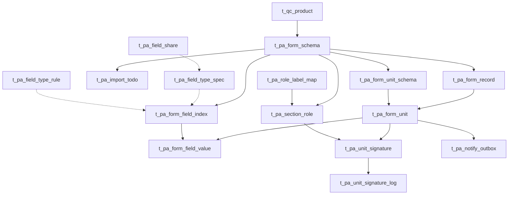

# PA 引擎数据表整理

整理日期：2026-09-08。来源：[PA 引擎数据表.pdf](../PA%20引擎数据表.pdf)，17 页，用户从 Claude artifact 打印保存。原链接：https://claude.ai/code/artifact/8013d671-863a-4da0-bd65-ca17945f5649 。

## 来源范围与完整性

本文逐页整理 PDF 中可见的全部 19 张 `data.t_pa_*` 表、字段、类型、默认值、枚举、索引和运行规则。PDF 是图片型文件，内容通过逐页渲染核对。本文不是数据库 DDL 导出，也没有验证这些 PA 表是否已经部署。

- 第 1 页声称“19 张表，每张表列出全部列、取值、索引”，但第 16 页的附件绑定日志明确写着“列清单未展开”。后 4 张表未给出完整类型和索引，不能认为已经获得完整物理结构。
- 原文多处将若干列合并一行，或者类型用横线省略。本文拆分字段记录；`未注明` 表示源文档没有提供，不能按命名猜测。
- 类型栏只复述原文。未出现 `NOT NULL` 不等于已经验证允许 NULL；合并行末尾的 `NOT NULL` 如作用范围不明确，会另行标出。
- `uk` 表示原文标注的唯一索引，`idx` 表示普通索引。原文没写名称、列或条件时，本文不补造。枚举是原文列出的业务取值，不代表已存在数据库 CHECK 约束。
- 第 1 至 2 页关系图右侧被裁切，第 17 页状态图右侧和底部也被裁切；“一批一份与作废重建”“跨表单字段引用”的后续图没有完整打印。
- 文档引用 DDL `sql/20260909_pa_role_chain_share.sql`，称其幂等、只动 `t_pa_*`。本地尚未找到这个文件，文件名不能当作迁移已执行的证据。
- 之前只读查询获得的 `t_qc_form_*` 和 `t_pd_form_*` 信息属于另一组表，不能替代这里的 PA 表结构。

## 总体模型

设计态随模板版本导入生成，确认后冻结；运行态是每个批次对应的实例。

|层次|表|作用|PDF 页|
|---|---|---|---|
|设计态|t_pa_form_schema|模板版本及 JSON 真源|2-4|
|设计态|t_pa_form_unit_schema|section 定义|4-5|
|设计态|t_pa_form_field_index|可填写字段索引|5-6|
|设计态|t_pa_section_role|section 角色链|6-7|
|设计态|t_pa_role_label_map|纸面签名词映射岗位|7|
|设计态|t_pa_field_share|跨模板字段暴露|7-8|
|设计态|t_pa_field_type_spec|指定字段类型|8|
|设计态|t_pa_field_type_rule|字段类型匹配规则|8-9|
|设计态|t_pa_import_todo|导入人工核对项|9-10|
|运行态|t_pa_form_record|批次表单实例|10-11|
|运行态|t_pa_form_unit|section 实例|11-12|
|运行态|t_pa_form_field_value|字段值及来源|12-13|
|运行态|t_pa_unit_signature|角色链签名状态|13-14|
|运行态|t_pa_unit_signature_log|只追加签名日志|14|
|运行态|t_pa_notify_outbox|岗位通知出站|14-15|
|运行态|t_pa_attachment_binding|附件绑定，暂无写入方|15-16|
|运行态|t_pa_attachment_binding_log|附件绑定日志，暂无写入方|16|
|运行态|t_pa_record_snapshot|实例快照，暂无写入方|16|
|运行态|t_pa_record_audit_log|实例审计日志，暂无写入方|16|

核心关系依据可见说明归纳，以下不是已验证的物理外键清单：



`schema_json` 是模板真源，包含 `units[].roleChain` 快照；角色链表是可查询投影。`field_share`、`field_type_spec`、`field_type_rule` 按 `form_code` 跨版本关联，不按 `schema_id` 绑定。字段配置依靠 `identity_key` 继承。

## 公共审计列

第 1 页说明：除 log 表外，各表包含以下列。逐表“审计列：有”表示加上此处六列；日志表仍可能显式包含 `create_by/create_time`，不等于具备整套公共列。

|列|原文类型与默认值|
|---|---|
|revision|integer DEFAULT 0|
|delete_flag|boolean DEFAULT false|
|create_by|varchar(64)|
|create_time|timestamp|
|update_by|varchar(64)|
|update_time|timestamp|

## 1. t_pa_form_schema

一个 `form_code` 的一个版本。`schema_json` 是真源，其余列是可查询投影。来源：第 2-4 页；审计列：有。

|列|原文类型与约束|说明或取值|
|---|---|---|
|id|bigserial PK|主键|
|form_code|varchar(128) NOT NULL|表单稳定标识|
|template_key|varchar(64) NOT NULL|模板逻辑码，同 form_code 各版本共享|
|version_seq|integer NOT NULL|整数版本序号|
|file_code|varchar(128)|受控文件编号|
|version_no|varchar(32) NOT NULL|受控版本号|
|title|varchar(255) NOT NULL|未另作说明|
|schema_json|text NOT NULL|原文引用“§5.6 JSON”，含 units[].roleChain 快照|
|schema_hash|varchar(64) NOT NULL|未另作说明|
|source_file_id|bigint|明确可空|
|source_file_name|varchar(255) NOT NULL|未另作说明|
|source_sha256|varchar(64) NOT NULL|重复导入判重|
|status|varchar(24) DEFAULT 'DRAFT'|DRAFT / CONFIRMED / RETIRED|
|unit_count|integer DEFAULT 0|原文与以下两列合并列出|
|blocking_todo_count|integer DEFAULT 0|阻断核对项数量|
|unexplained_diff_count|integer DEFAULT 0|未另作说明|
|validation_status|varchar(24) DEFAULT 'PENDING'|PENDING / PASSED / FAILED|
|validation_report_json|text|内部结构未给出|
|prev_version_id|bigint|升版来源|
|change_reason|varchar(500)|未另作说明|
|draft_by|varchar(64)|未另作说明|
|draft_time|timestamp|未另作说明|
|approve_by|varchar(64)|未另作说明|
|approve_time|timestamp|未另作说明|
|approve_signature_id|bigint|未另作说明|
|remark|varchar(500)|未另作说明|
|parser_version|varchar(32)|param-attr/2|
|product_id|bigint|t_qc_product.id；存草稿必传，建实例时带入|
|product_name|varchar(255)|产品名快照|

索引：`uk_pa_schema_version (form_code, version_no)`；`uk_pa_schema_template_seq (template_key, version_seq)`；`idx_pa_schema_status`；`idx_pa_schema_source_hash`。后两项未列索引列定义。

## 2. t_pa_form_unit_schema

模板里的一个 section（表）。确认位、复核位来源列只记录第一个对应岗位的来源，完整链在 `t_pa_section_role`。来源：第 4-5 页；审计列：有。

|列|原文类型与约束|说明或取值|
|---|---|---|
|id|未注明|原文合并行省略类型|
|schema_id|未注明|模板关联|
|unit_code|varchar(64) NOT NULL|位置身份码，例如 t2_1|
|unit_type|varchar(32) NOT NULL|PARAM_ATTR_TABLE / LEGACY_FALLBACK / LAYOUT_ONLY|
|semantic_type|varchar(64) DEFAULT 'UNKNOWN'|CLEARANCE 等，非完整枚举|
|workflow_required|boolean DEFAULT true|未另作说明|
|seq|integer NOT NULL|表序|
|title_text|varchar(500)|未另作说明|
|title_source|varchar(32)|未另作说明|
|title_template|varchar(1000)|未另作说明|
|column_signature|varchar(2048)|固定列与声明列的指纹；原文写“固定列 ‖ 声明列 指纹”|
|unit_schema_json|text NOT NULL|units[] 单节点|
|table_index|integer|未另作说明|
|source_block_start|integer|未另作说明|
|source_block_end|integer|未另作说明|
|confirmer_origin|varchar(24) NOT NULL|第一个确认位来源：SOURCE / SYSTEM_ADDED|
|confirmer_source_role|varchar(64)|未另作说明|
|reviewer_origin|varchar(24) NOT NULL|NONE / WAIVED / SOURCE / SYSTEM_ADDED|
|reviewer_source_role|varchar(64)|未另作说明|
|require_review|boolean DEFAULT true|清场单元为 false|
|heading_key|varchar(500)|未另作说明|
|field_count|integer DEFAULT 0|未另作说明|

索引：`uk (schema_id, unit_code)`；`uk (schema_id, seq)`。

## 3. t_pa_form_field_index

section 内每个可填写字段一行；签名岗位不进本表，但字段类型中包含 `SIGNATURE` 和 `REF_FIELD`。岗位签名链与签名类型字段应分别理解。来源：第 5-6 页；审计列：有。

|列|原文类型与约束|说明或取值|
|---|---|---|
|id|未注明|原文合并行省略类型|
|schema_id|未注明|未另作说明|
|unit_code|未注明|未另作说明|
|field_code|varchar(96) NOT NULL|code，在 schema 内唯一|
|field_label|varchar(255)|未另作说明|
|data_type|varchar(24) NOT NULL|STRING / DECIMAL / DATE / DATETIME / ENUM / …，未列全|
|control_type|varchar(32) NOT NULL|决议后控件|
|required_flag|boolean DEFAULT false|未另作说明|
|row_index|integer|值格源坐标|
|cell_index|integer|值格源坐标|
|position_index|integer DEFAULT 0|复合子字段为 1|
|source_start|integer|未用|
|source_end|integer|未用|
|source_evidence|varchar(32)|OPTION / UNIT / NAME|
|enum_json|varchar(2048)|内部结构未给出|
|format_json|varchar(2048)|内部结构未给出|
|formula_expr|varchar(1024)|computed 或 requiredWhen|
|sort_no|integer DEFAULT 0|未另作说明|
|source_key|varchar(512)|fieldKey|
|identity_key|varchar(512)|identity，配置层键，对接 field_type_spec / field_share|
|type_source|varchar(16)|SPEC / RULE / HINT / DEFAULT|
|hint_json|text|内部结构未给出|
|parent_field_code|varchar(96)|复合子字段指向主字段|
|field_type|varchar(32)|PdFieldType，含 SIGNATURE / REF_FIELD，未列全|
|config_json|text|内部结构未完整给出|
|group_name|varchar(255)|未另作说明|
|seq_no|varchar(32)|注意原文为字符类型|
|unit|varchar(32)|未另作说明|

索引：`uk (schema_id, field_code)`；`idx (schema_id, unit_code, sort_no)`；`idx (schema_id, identity_key)`。

## 4. t_pa_section_role

设计态角色链随 schema 版本冻结，一行一个岗位，seq 为流转顺序。来源：第 6-7 页；审计列：有。

|列|原文类型与约束|说明或取值|
|---|---|---|
|id|bigserial PK|主键|
|schema_id|bigint NOT NULL|未另作说明|
|unit_code|varchar(64) NOT NULL|未另作说明|
|seq|integer NOT NULL|从 1 开始的流转顺序|
|stage|varchar(16) NOT NULL|CONFIRM 可看可编辑；REVIEW 只看；确认位全部在前|
|role_codes_json|varchar(1024) NOT NULL DEFAULT '[]'|数组中任一角色可签，如 ["PD_OPERATOR","PD_OPERATOR_LEAD"]|
|label|varchar(64) NOT NULL|显示名，如操作人、复核人|
|notify|boolean DEFAULT true|轮到时是否按角色通知|
|origin|varchar(24) NOT NULL|SOURCE_TAIL / SYSTEM_ADDED / MANUAL|
|row_index|integer DEFAULT -1|表尾签名行源坐标|
|cell_index|integer DEFAULT -1|表尾签名行源坐标|

索引：`uk (schema_id, unit_code, seq)`。

## 5. t_pa_role_label_map

导入时把表尾签名行文字映射为默认岗位，生成初始角色链。来源：第 7 页；审计列：有。

|列|原文类型与约束|说明或取值|
|---|---|---|
|id|bigserial PK|主键|
|label|varchar(64) NOT NULL UNIQUE|操作人、复核人、清场人、审核人等|
|stage|varchar(16) NOT NULL|CONFIRM / REVIEW|
|role_codes_json|varchar(1024) NOT NULL|默认系统角色|
|enabled|boolean DEFAULT true|未另作说明|
|remark|varchar(500)|未另作说明|

索引：`uk (label)`。原文预置 7 条：

|label|stage|role_codes_json|
|---|---|---|
|操作人|CONFIRM|["PD_OPERATOR"]|
|确认人|CONFIRM|["PD_OPERATOR"]|
|清场人|CONFIRM|["PD_OPERATOR"]|
|整改人|CONFIRM|["PD_OPERATOR"]|
|复核人|REVIEW|["PD_OPERATOR_LEAD"]|
|审核人|REVIEW|["QA_REVIEWER"]|
|检查人|REVIEW|["QA_REVIEWER"]|

## 6. t_pa_field_share

允许其他模板引用的字段，按 form_code 跨版本，靠 identity_key 继承。未启用或未填 share_name 都不可被引用。来源：第 7-8 页；审计列：有。

|列|原文类型与约束|说明或取值|
|---|---|---|
|id|bigserial PK|主键|
|form_code|varchar(128) NOT NULL|所属模板，跨版本|
|identity_key|varchar(512) NOT NULL|字段身份：表头段、组名、字段名组合；精确编码规则未给出|
|share_name|varchar(64) NOT NULL|引用名，模板内唯一；正则 `^[a-z][a-z0-9_]{1,63}$`|
|enabled|boolean DEFAULT false|开关|
|remark|varchar(500)|未另作说明|

索引：`uk (form_code, identity_key)`；`uk (form_code, share_name)`。引用方在 `t_pa_field_type_spec` 配置 `REF_FIELD`，config_json 中提供 `sourceFormCode` 和 `shareName`。

## 7. t_pa_field_type_spec

按 form_code + identity_key 指定字段类型，type_source = SPEC。来源：第 8 页；审计列：有。

|列|原文类型与约束|说明或取值|
|---|---|---|
|id|未注明|未另作说明|
|form_code|varchar(128)|未另作说明|
|identity_key|varchar(512)|未另作说明|
|field_type|varchar(32)|含 REF_FIELD|
|config_json|text|REF_FIELD 配置包含 sourceFormCode、shareName|

索引：`uk (form_code, identity_key)`。

## 8. t_pa_field_type_rule

匹配规则批量决定字段类型，type_source = RULE。GLOBAL 或按 form_code 生效，按 priority 取胜；原文没说明数值大小优先方向。来源：第 8-9 页；审计列：有。

|列|原文类型与约束|说明或取值|
|---|---|---|
|id|未注明|未另作说明|
|scope|varchar(16) DEFAULT 'GLOBAL'|其他取值未明确列出|
|form_code|varchar(128)|未另作说明|
|match_json|varchar(1024)|内部匹配语法未给出|
|field_type|varchar(32)|未另作说明|
|config_json|text|内部结构未给出|
|priority|integer DEFAULT 100|规则优先级|
|enabled|boolean DEFAULT true|未另作说明|
|remark|varchar(500)|未另作说明|

索引：`idx (scope, form_code, enabled, priority)`。原文称预置 7 条全局规则，没有给出规则内容。

## 9. t_pa_import_todo

导入解析后需人工核对的问题清单，BLOCKING 项计入模板 blocking_todo_count。来源：第 9-10 页；审计列：有。

|列|原文类型与约束|说明或取值|
|---|---|---|
|id|未注明|未另作说明|
|schema_id|未注明|未另作说明|
|unit_code|varchar(64)|未另作说明|
|todo_type|varchar(64)|取值未给出|
|severity|varchar(16)|INFO / WARN / BLOCKING|
|message|varchar(1000)|未另作说明|
|source_locator_json|varchar(2048)|内部结构未给出|
|status|varchar(16) DEFAULT 'OPEN'|其他取值未给出|
|resolution|varchar(1000)|未另作说明|
|resolved_by|varchar(64)|未另作说明|
|resolved_time|timestamp|未另作说明|

索引：`idx (schema_id, severity, status, delete_flag)`；`idx (schema_id, unit_code)`。

## 10. t_pa_form_record

对外唯一实例 ID 为 id。一个 (form_code, batch_no) 对应一份非 VOID 实例，作废后同批可重建。来源：第 10-11 页；审计列：有。

|列|原文类型与约束|说明或取值|
|---|---|---|
|id|bigserial PK|对外唯一实例 ID|
|record_no|varchar(64) NOT NULL|原文格式 form_code-batch_no|
|schema_id|bigint NOT NULL|建单时固定模板版本|
|form_code|varchar(128)|与 form_version 合并行末写 NOT NULL，适用范围待 DDL 核实|
|form_version|varchar(32) NOT NULL|见上一行说明|
|product_id|bigint|从模板带入，请求另传且不同则拒绝|
|batch_id|bigint|未另作说明|
|batch_no|varchar(128) NOT NULL|批号|
|trace_code|varchar(128)|未另作说明|
|status|varchar(32) DEFAULT 'DRAFT'|DRAFT / IN_PROGRESS / COMPLETED / VOID|
|completed_unit_count|integer DEFAULT 0|未另作说明|
|total_unit_count|integer DEFAULT 0|未另作说明|
|blocking_todo_count|integer DEFAULT 0|未另作说明|
|current_snapshot_hash|varchar(64)|未另作说明|
|submit_by|未注明|原文合并行省略类型|
|submit_time|未注明|原文合并行省略类型|
|complete_time|未注明|原文合并行省略类型|
|remark|varchar(500)|未另作说明|
|void_reason|varchar(500)|作废信息|
|void_by|varchar(64)|作废信息|
|void_time|timestamp|作废信息|

索引：

- `uk_pa_record_no (record_no)`。
- `uk_pa_record_form_batch (form_code, batch_no) WHERE status <> 'VOID'`。
- `idx (batch_no, delete_flag)`。
- `idx (status, create_time DESC)`。
- `idx (product_id, status)`。
- `idx (schema_id, status, delete_flag)`。
- `idx (trace_code)`。

待核实：原文同时规定 record_no 为 form_code-batch_no、record_no 全局唯一、作废后同批重建。若重建沿用相同 record_no，会产生唯一性冲突；需要查明实际编号策略或作废处理。form_code 和 batch_no 各允许 128 字符，而 record_no 只有 64 字符，其编码和长度规则也需核实。

## 11. t_pa_form_unit

实例中的一个 section。current_seq 指向角色链当前岗位，运行中 status 为 `WAIT_<seq>`。来源：第 11-12 页；审计列：有。

|列|原文类型与约束|说明或取值|
|---|---|---|
|id|未注明|未另作说明|
|record_id|未注明|未另作说明|
|schema_unit_id|未注明|未另作说明|
|unit_code|varchar(64) NOT NULL|未另作说明|
|template_key|varchar(64)|与 version_seq、batch_no 合并行末写 NOT NULL，适用范围待核实|
|version_seq|integer|见上一行说明|
|batch_no|varchar(128) NOT NULL|完整定位链，见上说明|
|seq|integer NOT NULL|未另作说明|
|status|varchar(32) DEFAULT 'DRAFT'|`WAIT_<seq>` / DONE / REJECTED；另有默认 DRAFT|
|data_json|text NOT NULL|包含 values 和 valueSources，见 JSON 章节|
|data_hash|varchar(64)|未另作说明|
|saved_by|未注明|原文合并行省略类型|
|saved_time|未注明|原文合并行省略类型|
|submitted_by|未注明|原文合并行省略类型|
|submitted_time|未注明|原文合并行省略类型|
|completed_time|未注明|原文合并行省略类型|
|frozen_today|date|第一个确认位签字日，效期判定 TODAY|
|deviation|boolean DEFAULT false|任一判定子字段为“否”|
|current_seq|integer NOT NULL DEFAULT 1|当前岗位，0 表示全签完|

索引：`uk (record_id, unit_code)`；`uk (record_id, seq)`；`idx (record_id, status, delete_flag)`；`idx (batch_no, unit_code)`。

## 12. t_pa_form_field_value

每行带实例 ID，定位链为 (record_id, record_unit_id, unit_code, field_code)。来源三列记录引用与签字。来源：第 12-13 页；审计列：有。

|列|原文类型与约束|说明或取值|
|---|---|---|
|id|未注明|未另作说明|
|record_id|未注明|实例 ID|
|record_unit_id|未注明|未另作说明|
|schema_field_id|bigint NOT NULL|t_pa_form_field_index.id|
|template_key|类型未注明，NOT NULL|定位链；原文三列合并，仅写 NOT NULL|
|version_seq|类型未注明，NOT NULL|同上|
|batch_no|类型未注明，NOT NULL|同上|
|unit_code|varchar(64) NOT NULL|未另作说明|
|field_code|varchar(96) NOT NULL|未另作说明|
|value_text|text|原文称“权威值”|
|value_normalized|varchar(1000)|未另作说明|
|value_hash|varchar(64)|未另作说明|
|value_source|varchar(16)|MANUAL / SYSTEM / COMPUTED / REFERENCE / SIGNATURE|
|ref_record_id|bigint|REFERENCE 时的来源实例|
|ref_field_code|varchar(96)|REFERENCE 时的来源字段码|

索引：`uk (record_unit_id, field_code)`；`idx (record_id, unit_code)`；`idx (batch_no, unit_code, field_code)`；`idx (template_key, version_seq, unit_code)`；`idx (schema_field_id)`。

## 13. t_pa_unit_signature

角色链运行态，一岗位一行，按 seq 与设计态 t_pa_section_role 对齐。value_hash 只留痕，不驱动签名失效。来源：第 13-14 页；审计列：有。

|列|原文类型与约束|说明或取值|
|---|---|---|
|id|未注明|未另作说明|
|record_id|未注明|未另作说明|
|record_unit_id|未注明|未另作说明|
|unit_code|varchar(64) NOT NULL|未另作说明|
|seq|integer NOT NULL DEFAULT 1|岗位序号|
|label|varchar(64)|显示名|
|role_codes_json|varchar(1024)|可签的系统角色码数组，任一角色|
|stage|varchar(16)|CONFIRM / REVIEW|
|origin|varchar(24)|SOURCE_TAIL / SYSTEM_ADDED / MANUAL|
|user_id|bigint|签字人|
|user_name|varchar(64)|签字人|
|signature_id|bigint|签字人相关签名 ID，外键目标未说明|
|signed_time|timestamp|签字时间|
|value_hash|varchar(64)|签字时 section 值哈希，只留痕|
|status|varchar(24) DEFAULT 'PENDING'|PENDING / SIGNED|

索引：`uk (record_id, unit_code, seq)`；`uk (record_unit_id, seq)`。

## 14. t_pa_unit_signature_log

只追加；签后改值在这里记录 VALUE_CHANGED_AFTER_SIGN。来源：第 14 页；公共审计列：无，仍显式列出 create_by/create_time。

|列|原文类型与约束|说明或取值|
|---|---|---|
|id|未注明|未另作说明|
|record_id|未注明|未另作说明|
|record_unit_id|未注明|未另作说明|
|unit_code|varchar(64)|未另作说明|
|seq|integer DEFAULT 0|未另作说明|
|role_code|varchar(24)|未另作说明|
|action_code|varchar(24)|SIGN / RESET / REJECT / VALUE_CHANGED_AFTER_SIGN|
|origin|varchar(24)|未明确重列取值|
|source_role|varchar(64)|未另作说明|
|operator_id|bigint|未另作说明|
|operator_name|varchar(64)|未另作说明|
|reason|varchar(500)|未另作说明|
|before_hash|varchar(64)|未另作说明|
|after_hash|varchar(64) NOT NULL|未另作说明|
|sign_time|timestamp DEFAULT now|原文写 now，准确 SQL 表达式待 DDL 核实|
|create_by|未注明|原文显式列出，类型省略|
|create_time|未注明|原文显式列出，类型省略|

索引：原文未提供，不代表没有索引。

## 15. t_pa_notify_outbox

section 轮到某岗位时按角色通知，角色下全部人各一条。退避重试间隔为 1、5、30、120、300 秒，最多 10 次。来源：第 14-15、17 页；审计列：有。

|列|原文类型与约束|说明或取值|
|---|---|---|
|id|未注明|未另作说明|
|record_id|未注明|未另作说明|
|record_unit_id|未注明|未另作说明|
|unit_code|varchar(64)|未另作说明|
|seq|integer|轮到的岗位|
|role_codes_json|varchar(1024)|按角色发|
|channel|varchar(16)|INBOX：站内待办，前端按角色拉取；DINGTALK：thirdparty 工作通知|
|title|varchar(255)|未另作说明|
|content|varchar(1000)|未另作说明|
|status|varchar(16) DEFAULT 'PENDING'|PENDING / SENT / DEAD|
|attempts|integer DEFAULT 0|未另作说明|
|next_at|timestamp|下次重试时间|
|last_error|varchar(1000)|未另作说明|

索引：`idx (status, next_at)`。待核实：原文称每人一条，但可见字段没有接收用户列，需要实际 DDL 或实现解释接收者定位。

## 16. t_pa_attachment_binding

原文标记“暂无写入方”。来源：第 15-16 页；审计列：有。

|可见列|类型、约束、含义|
|---|---|
|record_id|未提供|
|record_unit_id|未提供|
|unit_code|未提供|
|row_index|未提供|
|slot_index|未提供|
|file_id|未提供|
|file_name|未提供|
|file_url|未提供|
|content_sha256|未提供|
|storage_version|未提供|
|status|未提供|

未提供主键、索引、外键或完整 DDL；不能断言上述就是全部物理列。

## 17. t_pa_attachment_binding_log

来源：第 16 页。原文只有“暂无写入方”“列清单未展开”。没有可转录的列明细、类型、约束或索引。按总述 log 表不含公共审计列，具体字段仍待 DDL 核实。

## 18. t_pa_record_snapshot

原文标记“暂无写入方”。来源：第 16 页；审计列：有。

|可见列或原文缩写|类型、约束、含义|
|---|---|
|record_id|未提供|
|snapshot_type|未提供|
|snapshot_json|未提供；JSON 内部结构未给出|
|snapshot_hash|未提供|
|previous_hash|未提供|
|reason|未提供|
|operator_*|原文通配缩写，不是已经确认的单个字段名，不能展开为具体列|

未提供主键、索引、外键或完整 DDL。

## 19. t_pa_record_audit_log

原文标记“暂无写入方”，签后改值目前只记在 t_pa_unit_signature_log。来源：第 16 页；按总述 log 表不含公共审计列，具体字段待 DDL 核实。

|可见列或原文缩写|类型、约束、含义|
|---|---|
|record_id|未提供|
|record_unit_id|未提供|
|unit_code|未提供|
|action_code|未提供|
|field_code|未提供|
|before_value_hash|未提供|
|after_value_hash|未提供|
|reason|未提供|
|operator_*|原文通配缩写，具体列未给出|
|action_time|未提供|

未提供主键、索引、外键或完整 DDL。

## JSON 内部结构与缺口

原文列出了 JSON 容器和少数键，没有给出完整 JSON Schema。以下明确区分可确认内容和未提供内容。

|表与列|可确认内容|未提供内容|
|---|---|---|
|form_schema.schema_json|模板真源；有 units 数组，units[].roleChain 快照|§5.6 对应正文不在 PDF；根级全部键、unit 全部属性、字段节点结构、必填规则|
|form_unit_schema.unit_schema_json|schema_json.units[] 的单节点|完整单节点 schema|
|form_schema.validation_report_json|验证报告容器|全部内部键、错误结构|
|section_role.role_codes_json|系统角色码数组；任一角色可签；默认 []|角色码全集、角色解析契约|
|role_label_map.role_codes_json|默认系统角色数组；7 条预置见表 5|是否还有动态扩展规则|
|unit_signature.role_codes_json|运行态可签角色码数组|快照更新规则|
|notify_outbox.role_codes_json|按角色发送|接收人快照及去重规则|
|field_index.enum_json|枚举配置|值与显示标签结构、单多选格式|
|field_index.format_json|格式配置|格式键、精度、单位、日期规则|
|field_index.hint_json|类型提示容器|所有提示键和取值|
|field_index.config_json|字段配置容器|各 PdFieldType 的配置 schema|
|field_type_spec.config_json|REF_FIELD 有 sourceFormCode、shareName|其他字段类型配置、引用值解析时机与选实例规则|
|field_type_rule.match_json|字段匹配规则|匹配语法、运算符、组合结构|
|field_type_rule.config_json|规则输出字段配置|各类型配置 schema|
|import_todo.source_locator_json|问题源定位容器|页、表、行、列等键的真实命名与基准|
|form_unit.data_json|values 按 code 存值；valueSources 按 code 存来源|值序列化、来源对象内部结构、空值语义、写入 API|
|record_snapshot.snapshot_json|实例快照容器|完整快照结构|

原文对 data_json 的结构写为 `{values:{code:value}, valueSources:{code:…}}`。下面仅作合法 JSON 的结构示意，不是可直接提交的请求：

```json
{
  "values": {
    "<field_code>": "<字段值，实际类型待接口确认>"
  },
  "valueSources": {
    "<field_code>": "<来源结构，原文省略>"
  }
}
```

REF_FIELD 的 config_json 可确认两个键，示意如下；实际值由源表单和暴露字段决定：

```json
{
  "sourceFormCode": "<源表单 form_code>",
  "shareName": "<源字段 share_name>"
}
```

注意 `value_source` 数据库列与 JSON `valueSources` 不是同一个字段名。原文没有证明 JSON 来源项直接就是 MANUAL 等字符串，不能据此自行确定接口格式。

## 状态与流转

来源：第 10-17 页文字与可见状态图。

1. 模板设计态状态有 DRAFT、CONFIRMED、RETIRED；确认后版本冻结。新建实例固定 schema_id，并从模板带入 product_id。
2. 表单实例状态有 DRAFT、IN_PROGRESS、COMPLETED、VOID。同 form_code、batch_no 只允许一份非 VOID 实例，作废后可重建；编号唯一性细节见表 10 的待核实项。
3. 角色链确认位 CONFIRM 全部排在复核位 REVIEW 前面。CONFIRM 可看可编辑，REVIEW 只看；每个岗位中任一允许角色可签。
4. section 按 current_seq 流转。图例为 WAIT_1 -> WAIT_2 -> WAIT_3 -> DONE；完成时 current_seq = 0。第一个确认位签字日写入 frozen_today，用于效期 TODAY 判定。
5. 复核位 REJECT 后 section 为 REJECTED，签名行全部回到 PENDING。驳回后的再次提交、current_seq 如何重设，PDF 没有完整说明。
6. 签名岗位状态只有 PENDING、SIGNED。签后改值只记录 VALUE_CHANGED_AFTER_SIGN，value_hash 留痕，不驱动签名失效。
7. 岗位轮到时进入通知 PENDING，成功为 SENT。失败 attempts 加 1、写 last_error、next_at = 当前时间 + 退避间隔，继续 PENDING；第 10 次仍失败进入 DEAD。退避间隔给出 1、5、30、120、300 秒，但超过五档如何复用未明确说明。
8. 跨表单引用先在源模板暴露 share_name，再在引用方配置 REF_FIELD 的 sourceFormCode/shareName。字段值层保存 REFERENCE、ref_record_id、ref_field_code。源实例选择、刷新、快照及版本兼容规则在 PDF 中未给全。

## 与识别结果对齐的设计建议

本节是根据上述文档提出的建议，不是来源中已经存在的导入 API，也未实现或写入数据库。

### 先确定目标模型

本 PDF 是 PA 引擎，实例按 section 存 `data_json.values/valueSources`。此前在数据库查询到的 QC 模型使用 `doc_json.fields/groups`，两者不能混用。如果目标已经确定为 PA，转换器应以 PA 的 schema、unit_code、field_code 为目标，不能照搬 QC 的 payload。

### 建立四级对应关系

|识别侧信息|目标 PA 信息|匹配与处理建议|
|---|---|---|
|文件、表单编号、版本、产品|form_schema / schema_id|先核实模板版本兼容性，不仅按标题匹配|
|表格标题、上下文、列结构、跨页连续性|form_unit_schema / unit_code|TeX 物理表格只是来源块，可能跨页合并或需拆成多个 section|
|行头、列头、字段标签、组名、源坐标|form_field_index / field_code|结合 field_label、group_name、seq_no、unit、row_index/cell_index 匹配；行号不能单独作为业务身份|
|原始值、勾选状态、置信度、原文位置|form_unit.data_json.values 与审阅证据|按 data_type、field_type、config_json、enum_json 验证并转换；证据与正式 payload 分开维护|

field_code 是 schema 内唯一的目标字段码；identity_key 是配置层的跨版本字段身份；source_key 是 fieldKey。三者不可互相替代。unit_code 的例子 t2_1 是位置身份码，不能假定跨版本永远稳定。

### 字段取舍

- 可填写、可对齐且类型验证通过的业务值进入候选 values；低置信度、冲突或匹配不唯一的值进入核对报告。
- 固定文字、设备名称型号、表头、说明、单位等保留为匹配证据；只有目标定义确实要求填写时，才转成字段值。
- 空白、未识别、未勾选、不适用必须区分。单选、多选转换必须先读取目标枚举与实际 API 契约。
- 复合单元格按目标 parent_field_code、position_index 拆分，不把整段文字塞进一个子字段。
- 表尾“操作人/复核人”等岗位用于识别角色链；手写姓名只是历史纸面证据，不能自动生成有效电子签名或 SIGNED 状态。
- COMPUTED、REFERENCE、SIGNATURE 类值由引擎规则与授权流程决定。OCR 不能自行冒充这些来源。PDF 没有 OCR 类型的 value_source，需先明确合法接入方式，不能擅自扩展枚举或默认写 SYSTEM。
- 页码、TeX 行、识别 field_id、候选匹配、置信度、原始值等存于独立 alignment 报告；不要向引擎 JSON 塞入未确认支持的键。

建议输出两个产物：一份包含全部源证据和匹配状态的 alignment.json；一份按 unit_code 分组、使用目标 field_code 的候选值文件。正式 API 请求格式及 valueSources 内部结构确认后，再生成可提交 payload。写入应通过引擎业务接口同步校验、索引与审计，不能仅更新 JSON 或直接插入某一张投影表。

## 后续补齐清单

为获得“全部详细结构”，仍需以下原始材料；本次不以猜测补全：

1. `sql/20260909_pa_role_chain_share.sql` 及相关建表迁移，核实 19 表全部物理列、PK、FK、NULL、DEFAULT、索引、CHECK 与逻辑删除条件。
2. PDF 引用的 §5.6 JSON 定义及真实 PA 模板 JSON，补齐 units、字段节点、roleChain 的全部属性与值域。
3. PA 保存/建单/导入接口 DTO 与一份真实 section data_json，确定 values 类型、valueSources 结构、空值语义与服务端派生字段。
4. PdFieldType、data_type、control_type 完整枚举，以及每种 config_json、match_json、enum_json、format_json 的解析契约和预置 7 条全局规则。
5. 后 4 表完整 DDL，尤其 attachment_binding_log 的全部列以及 operator_* 的具体列名。
6. 完整关系图与状态图，核实作废重建编号、引用实例选择、岗位驳回恢复和通知接收人定位。

当前完成的是 PDF 中可见内容的全量整理；原文缺失的数据库细节和 JSON 定义尚未获得。
